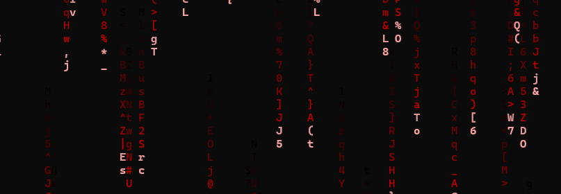

<div align="center">

```
██╗    ██╗███╗   ███╗ █████╗ ████████╗██████╗ ██╗██╗  ██╗
██║    ██║████╗ ████║██╔══██╗╚══██╔══╝██╔══██╗██║╚██╗██╔╝
██║ █╗ ██║██╔████╔██║███████║   ██║   ██████╔╝██║ ╚███╔╝ 
██║███╗██║██║╚██╔╝██║██╔══██║   ██║   ██╔══██╗██║ ██╔██╗ 
╚███╔███╔╝██║ ╚═╝ ██║██║  ██║   ██║   ██║  ██║██║██╔╝ ██╗
 ╚══╝╚══╝ ╚═╝     ╚═╝╚═╝  ╚═╝   ╚═╝   ╚═╝  ╚═╝╚═╝╚═╝  ╚═╝
```

**The Matrix has you... on Windows Terminal.**

[](https://golang.org/)
[]()
[]()

</div>

---

## ✨ What is wmatrix?

**wmatrix** is a native terminal-based Matrix digital rain effect for Windows, inspired by the classic `cmatrix` from Linux. Built in **Go** with zero dependencies beyond the terminal itself.

No browser. No Canvas. No GPU melting your laptop. Just pure terminal magic ✨



> "Unfortunately, no one can be told what the Matrix is. You have to see it for yourself."

---

## 🚀 Quick Start

### Prerequisites

- [Go 1.21+](https://golang.org/dl/) installed
- Windows Terminal, PowerShell, CMD, or any modern terminal emulator

### Install & Run

```bash
# Clone the repository
git clone https://github.com/QuantumDev/wmatrix.git
cd wmatrix

# Build
go build -o wmatrix.exe .

# Run
.\wmatrix.exe
```

That's it. The Matrix awakens.

---

## 🎮 Controls

| Key | Action |
|:---:|:---|
| `Q` / `ESC` / `Ctrl+C` | Exit the Matrix |
| `P` | Pause |
| `B` | Toggle **bold** mode (bright head) |
| `R` | Toggle **rainbow** mode |
| `1` | ASCII mode (classic cmatrix) |
| `2` | Katakana mode (movie style) |
| `3` | Binary mode (0/1) |
| `4` | Numbers mode |
| `5` | Mixed mode (ASCII + Katakana) |
| `+` / `-` | Speed up / slow down |

---

## 🎨 Command Line Options

```bash
.\wmatrix.exe [options]
```

| Option | Default | Description |
|:---|:---:|:---|
| `-mode` | `ascii` | Character set: `ascii`, `katakana`, `mixed`, `binary`, `numbers` |
| `-color` | `120` | Hue (0-360). 120=green, 0=red, 200=blue, 280=purple |
| `-sat` | `1.0` | Saturation 0-1 |
| `-light` | `0.5` | Lightness 0-1 |
| `-speed` | `10` | Fall speed 1-20 |
| `-bold` | `true` | Bright head effect |
| `-rainbow` | `false` | Auto color shifting |
| `-async` | `true` | Async column speeds |
| `-fps` | `30` | Max FPS 15-60 |

### Examples

```bash
# Classic green Matrix
.\wmatrix.exe

# Red pill
.\wmatrix.exe -color 0

# Movie-style katakana
.\wmatrix.exe -mode katakana

# Cyberpunk rainbow
.\wmatrix.exe -rainbow -fps 60

# Low-key, low-CPU
.\wmatrix.exe -fps 15 -speed 5
```

---

## 🖥️ Why Terminal Instead of Browser?

| | Browser (Canvas) | **wmatrix (Terminal)** |
|:---|:---|:---|
| **GPU Usage** | High (compositor + shaders) | **None** |
| **CPU Usage** | Medium-High | **Low** |
| **Redraw** | Full screen every frame | **Only changed cells** |
| **Memory** | ~8MB canvas | **~2KB grid** |
| **Fan Noise** | 🔥🔥🔥 | **😴 Silent** |
| **Authenticity** | Web toy | **Real cmatrix feel** |

---

## 🧬 Character Modes

### ASCII (Default)
Classic `cmatrix` style with letters, numbers, and symbols.

```
a b C D 3 9 ! @ # $ % ^ & * ( ) _ + - = [ ] { } | ; : , . < > ?
```

### Katakana
The iconic Japanese characters from *The Matrix* (1999).

```
ア イ ウ エ オ カ キ ク ケ コ サ シ ス セ ソ ...
```

### Mixed
Best of both worlds.

### Binary
Digital rain for the purists.

```
0 1 0 0 1 1 0 1 0 1 1 0 0 0 1 ...
```

### Numbers
Minimalist numeric cascade.

---

## 🔧 Building from Source

```bash
# Standard build
go build -o wmatrix.exe .

# Optimized build (smaller binary)
go build -ldflags="-s -w" -o wmatrix.exe .

# Cross-compile for other platforms (optional)
# Linux
GOOS=linux GOARCH=amd64 go build -o wmatrix-linux

# macOS
GOOS=darwin GOARCH=amd64 go build -o wmatrix-macos
```

---

## 📁 Project Structure

```
wmatrix/
├── go.mod          # Go module definition
├── go.sum          # Dependency checksums
├── main.go         # All the magic
└── README.md       # You are here
```

Single file. No bloat. Pure Go.

---

## 🤝 Contributing

Pull requests welcome! Whether it's:

- New character modes
- Color presets
- Performance optimizations
- Bug fixes

Just keep it terminal-native. No Electron, no browser bundles.

---

## 📜 License

MIT License — do whatever you want. Just don't use it to build Skynet.

---

<div align="center">

```
by QuantumDev
```

Made with 💚 and a lot of green pixels.

</div>
